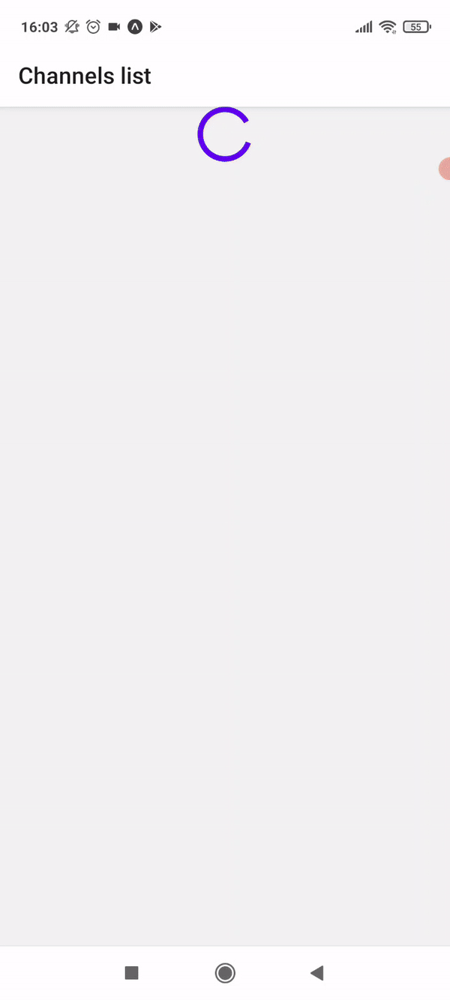

# yt-subs-groups-app
Small react native app to group Youtube channels subscriptions.  
This app was build using server-client architecture, [here](https://github.com/Nymfeparakit/yt-subs-groups-api) is API which it connects to.

## Main usage
1. Create groups of Youtube channels from subscriptions based on their content (eg. Study videos, Programming tutorials, Letsplays)
2. Watch videos feed from certain group  

<table align="center">
  <tr>
    <td></td>
    <td>   </td>
    <td></td>
  </tr>
</table>  

